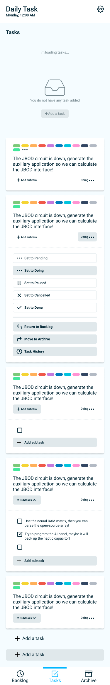

# daily-task
A basic todo application that follows the kanban style of task management.

#todo #task-manager #todolist #javascript #react #redux-toolkit #react-hooks #rxdb #pwa-apps #SCSS



## Contribute
If you are interested in joining in

Clone the repository
```bash
git clone https://github.com/ebukaodini/daily-task.git 
```

Check out the tasks left on the [Trello board](https://trello.com/b/7AbEQvnQ/daily-task)

You'd find the local design screens [here](./design-screens/) and the figma designs [here](https://www.figma.com/file/MyWby1hv42rV3lXMWYK1wS)
